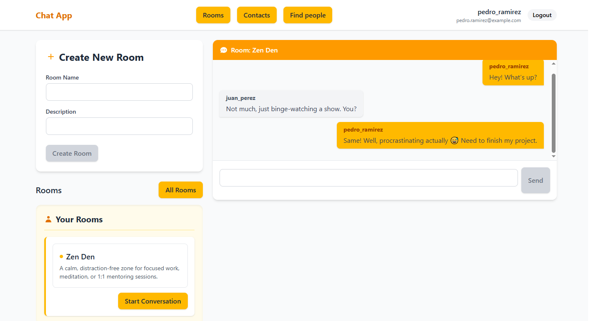

# 🟦 ChatApp – Real-Time Chat Application

**ChatApp** is a real-time messaging application where users can chat in public rooms or private conversations. It includes JWT-based authentication, persistent message history, and a modern interface built with React and TailwindCSS.



---

## 🚀 Key Features

- ✅ User authentication with JWT (Register/Login)
    
- 🧑‍🤝‍🧑 Public rooms: create, join, and chat with others
    
- 🔒 Private messaging with contacts
    
- 💾 Persistent message history (Database)
    
- 🧭 Auto-scroll to the latest message
    
- 👀 Modern, responsive interface with TailwindCSS

---

## 🛠️ Installation & Usage

### 1. Clone the repository

```bash
git clone https://github.com/Jesus24-Dev/real-time-chat-ReactTS-Socket.io
```

### 2. Setup environment variables

Create a `.env` file in both `client` and `server` directories based on the provided `.env.example`.

#### 📁 Client (`client/.env`)

```env 
VITE_REACT_URL_API=http://localhost:3030/api VITE_REACT_URL_SOCKET=http://localhost:3030
```

#### 📁 Server (`server/.env`)

```env
PORT=3030 
SECRET_KEY=secret_key 
FRONTEND_URL=http://localhost:5173
```

### 3. Run the app

Open two terminals to run both the frontend and backend.

#### ▶️ Client

```bash
cd client npm install npm run dev
```


#### ▶️ Server

```bash
cd server npm install npm start
```


### 4. Ready to chat

Visit `http://localhost:5173` in your browser, register a user, and start chatting!

---

## 🧰 Tech Stack

### 🔙 Backend

- [Express](https://expressjs.com/)
    
- [TypeScript](https://www.typescriptlang.org/)
    
- [Sequelize (SQLite)](https://sequelize.org/)
    
- [Socket.IO](https://socket.io/)
    
- [JSONWebToken](https://github.com/auth0/node-jsonwebtoken)
    

### 🔜 Frontend

- [React](https://reactjs.org/)
    
- [TypeScript](https://www.typescriptlang.org/)
    
- [TailwindCSS](https://tailwindcss.com/)
    
- Socket.IO Client
    

---

## 🔮 Future Improvements

- ✅ File/image sharing in chat
    
- ✅ Sound notifications
    
- ⏳ Real-time connection status
    
- 🗓️ Filter/search messages by date
    
- 🌐 Internationalization (i18n)
    
- 📱 Mobile-friendly version

- 🔔 Visual notifications for new messages
    
- 📝 "User is typing..." indicator

- ✨ Smooth UI animations

---

## 🤝 Contributing

Want to contribute? Suggestions, feedback, and pull requests are welcome!

1. Fork the repository
    
2. Create a new branch: `git checkout -b feature/your-feature`
    
3. Commit your changes: `git commit -m "Add new feature"`
    
4. Push the branch: `git push origin feature/your-feature`
    
5. Open a Pull Request
    

---

## 📩 Contact

Developed by **Jesus24-Dev**  
📧 siritjesus24@gmail.com  
🔗 [@Jesus24-Dev](https://github.com/Jesus24-Dev)

---
